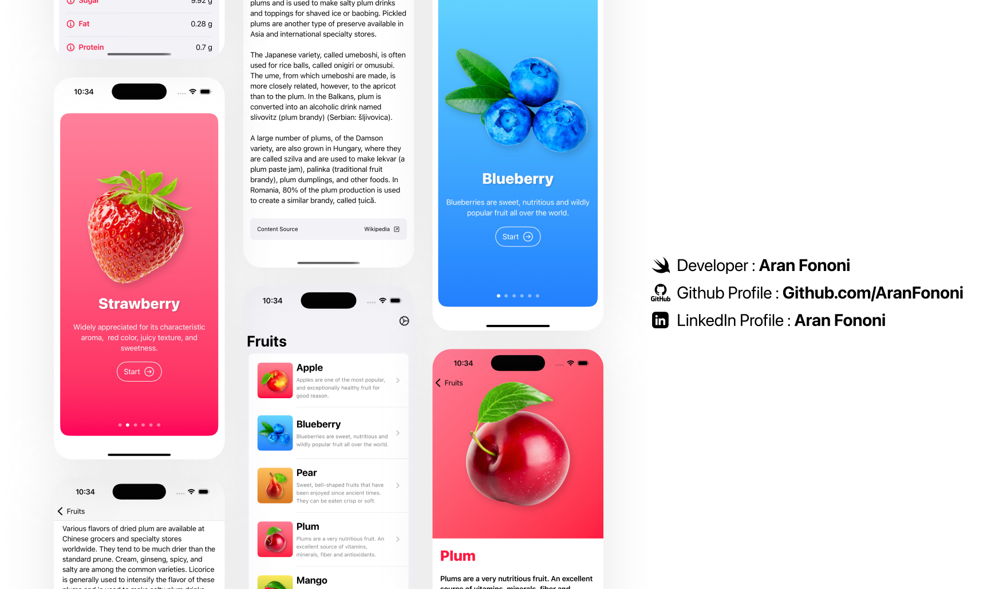

# Fruits App 🍎🍇🍓  

### SwiftUI Masterclass – Chapter 12 Project  

This project was part of the Udemy SwiftUI Masterclass course. It’s a simple and clean fruits-themed app that shows how to build modular UI with reusable components, navigation, and onboarding screens.

---

## 📌 Project Overview  
The app displays a list of fruits with beautiful images, fun facts, and a detailed view for each item. There’s also an onboarding screen and a settings section to toggle app state.  

Everything is built using **SwiftUI**, with a focus on layout, navigation, and reusable views.  

---

## 🧩 What I Learned  
- Creating reusable components  
- Using **NavigationView**, **NavigationLink**, and **Sheets**  
- Building custom UI elements  
- Working with @State and @AppStorage  
- Managing onboarding flow  

---

## 🍿 Features  
✅ Onboarding with a card-style carousel  
✅ Fruit list with navigation to detail screens  
✅ Modular views (cards, headers, rows, settings)  
✅ Clean UI with gradients and icons  
✅ Settings screen with toggle for restarting onboarding  

---

## 📸 Screenshot  

---

## 🛠️ How to Run  
1. Clone the repo  
2. Open the project in Xcode  
3. Run on any iOS device or simulator (iOS 15+)  

---

## 📬 Contact  
For feedback or questions, reach out:  
- **Email**: [aranfononi@gmail.com](mailto:aranfononi@gmail.com)  
- **LinkedIn**: [Aran Fononi](https://www.linkedin.com/in/aran-fononi-18182b265)
